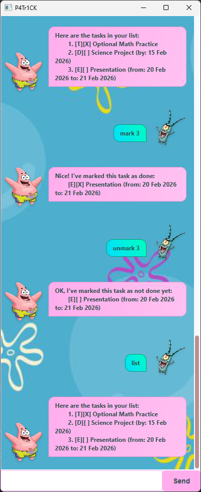

# Patrick User Guide

Patrick is a task management chatbot that helps you keep track of your todos, deadlines, and events. It provides a simple command-line interface to add, list, mark as done, delete, and search tasks.



## Quick Start

1. Ensure you have Java 17 or above installed.
2. Download the latest JAR file from the releases page.
3. Run the JAR file: `java -jar patrick.jar`
4. Start managing your tasks!

## Features

### Adding Tasks

#### Adding a Todo: `todo`

Adds a simple task without any date.

Example:

```
todo read book
```

Expected output:

<pre>
Got it. I've added this task:
[T][ ] read book
Now you have 1 tasks in the list.
</pre>

#### Adding a Deadline: `deadline`

Adds a task with a due date.

Example:

```
deadline submit assignment /by 2026-12-12
```

Expected output:

<pre>
Got it. I've added this task:
[D][ ] submit assignment (by: 12 Dec 2026)
Now you have 2 tasks in the list.
</pre>

#### Adding an Event: `event`

Adds a task with a start and end date.

Example:

```
event team meeting /from 2026-12-01 /to 2026-12-01
```

Expected output:

<pre>
Got it. I've added this task:
[E][ ] team meeting (from: 1 Dec 2026 to: 1 Dec 2026)
Now you have 3 tasks in the list.
</pre>

### Listing Tasks

#### Listing All Tasks: `list`

Displays all tasks in the list.

Example:

```
list
```

Expected output:

<pre>
Here are the tasks in your list:
1. [T][ ] read book
2. [D][ ] submit assignment (by: 12 Dec 2026)
3. [E][ ] team meeting (from: 1 Dec 2026 to: 1 Dec 2026)
</pre>

#### Listing Tasks Due On: `due`

Displays tasks due on a specific date.

Example:

```
due 2026-12-12
```

Expected output:

<pre>
Tasks due on 12 Dec 2026:
1. [D][ ] submit assignment (by: 12 Dec 2026)
</pre>

#### Listing Tasks On: `on`

Displays tasks happening on a specific date.

Example:

```
on 2026-12-01
```

Expected output:

<pre>
Tasks on 2026-12-01:
1. [E][ ] team meeting (from: 1 Dec 2026 to: 1 Dec 2026)
</pre>

### Managing Tasks

#### Marking a Task as Done: `mark`

Marks a task as completed.

Example:

```
mark 1
```

Expected output:

<pre>
Nice! I've marked this task as done:
[T][X] read book
</pre>

#### Unmarking a Task: `unmark`

Marks a task as not done.

Example:

```
unmark 1
```

Expected output:

<pre>
OK, I've marked this task as not done yet:
[T][ ] read book
</pre>

#### Deleting a Task: `delete`

Removes a task from the list.

Example:

```
delete 1
```

Expected output:

<pre>
Noted. I've removed this task:
[T][ ] read book
Now you have 2 tasks in the list.
</pre>

### Searching Tasks

#### Finding Tasks: `find`

Searches for tasks containing a keyword.

Example:

```
find assignment
```

Expected output:

<pre>
Here are the matching tasks in your list:
1. [D][ ] submit assignment (by: 12 Dec 2026)
</pre>

### Exiting the Application

#### Bye: `bye`

Exits the application.

Example:

```
bye
```

## Command Summary

| Command  | Format                                        | Example                                         |
| -------- | --------------------------------------------- | ----------------------------------------------- |
| Todo     | `todo <description>`                          | `todo read book`                                |
| Deadline | `deadline <description> /by <date>`           | `deadline submit assignment /by 2026-12-12`     |
| Event    | `event <description> /from <start> /to <end>` | `event meeting /from 2026-12-01 /to 2026-12-01` |
| List     | `list`                                        | `list`                                          |
| Due      | `due <date>`                                  | `due 2026-12-12`                                |
| On       | `on <date>`                                   | `on 2026-12-01`                                 |
| Mark     | `mark <index>`                                | `mark 1`                                        |
| Unmark   | `unmark <index>`                              | `unmark 1`                                      |
| Delete   | `delete <index>`                              | `delete 1`                                      |
| Find     | `find <keyword>`                              | `find book`                                     |
| Bye      | `bye`                                         | `bye`                                           |

## FAQ

**Q: How do I transfer my data to another computer?**

A: Copy the `data/tasks.txt` file to the same location on the new computer.

**Q: What happens if I enter an invalid command?**

A: Patrick will display an error message and prompt for a valid command.

**Q: Can I edit tasks after adding them?**

A: Currently, you can only mark/unmark or delete tasks. Editing is not supported yet.

## Known Issues

- Dates must be in YYYY-MM-DD format.
- The application saves data automatically on each command that modifies the task list.
